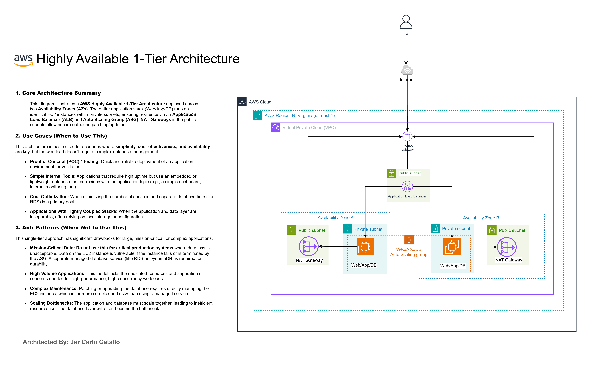
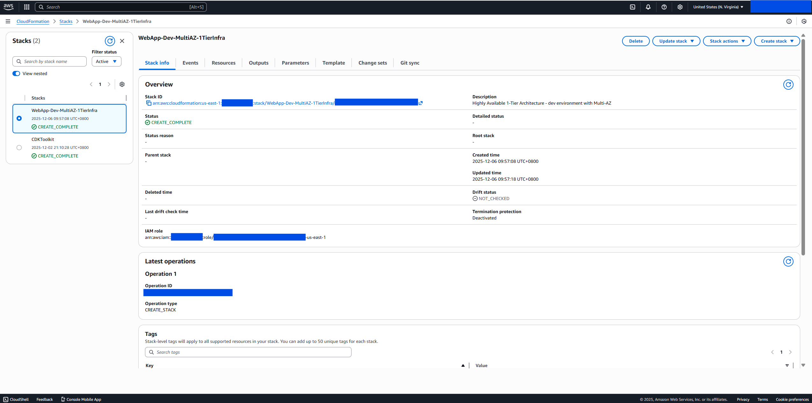
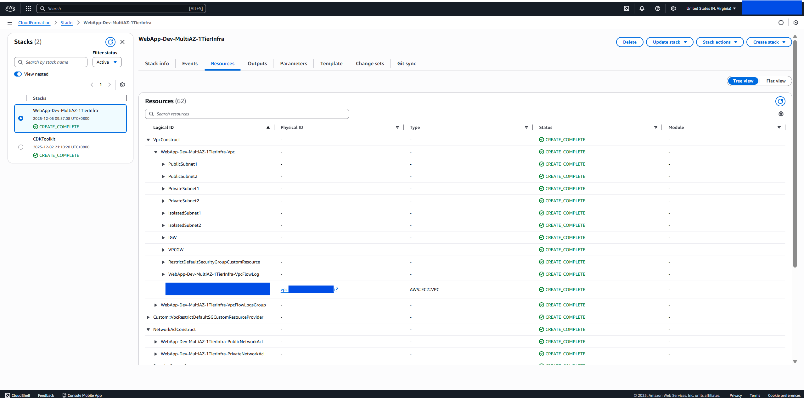
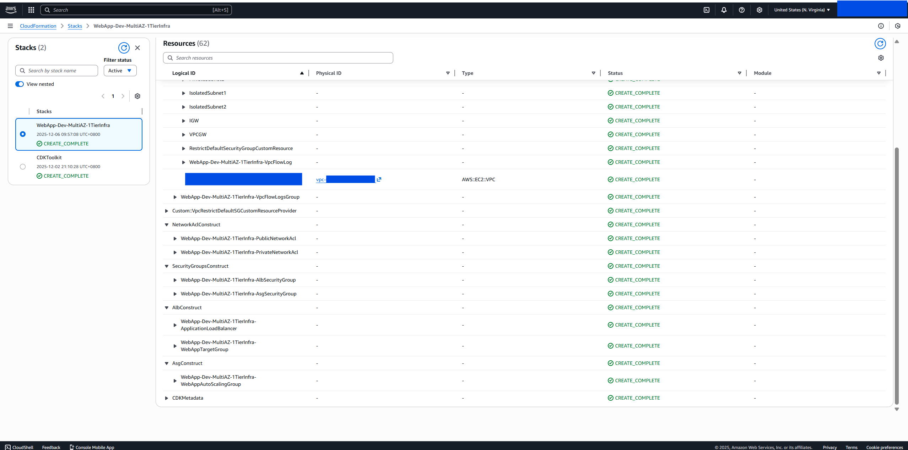
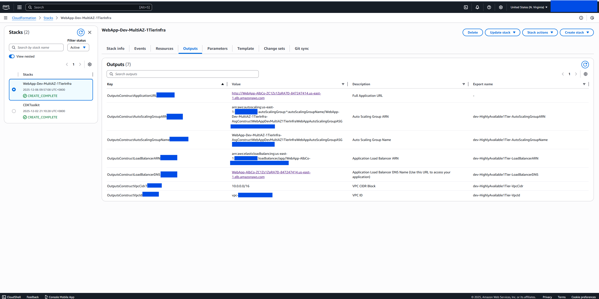
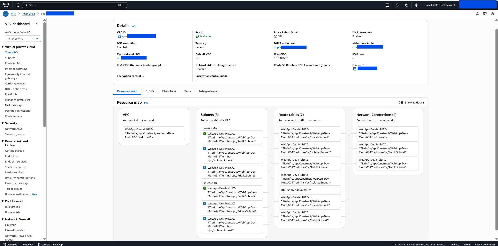
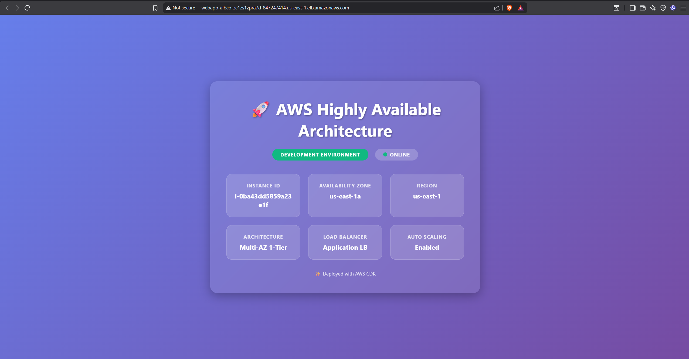

# AWS Highly Available One-Tier Architecture


> **Production-grade infrastructure made repeatable**: Deploy highly available, auto-scaling applications across multiple availability zones with battle-tested Infrastructure as Code.

**⚠️ EDUCATIONAL PURPOSE ONLY**: This project is designed for learning AWS infrastructure patterns and CDK development. Not intended for production use without proper review, testing, and customization.

**📝 Architecture Note**: This is a **true 1-tier architecture** where all application logic and data storage resides within the application tier. There is no separate database layer.

---

## Quick Start

### Prerequisites
- AWS CLI configured with credentials
- Node.js 18+ and npm
- AWS CDK CLI: `npm install -g aws-cdk`

### Deploy in 3 Steps

```bash
# 1. Install dependencies
npm install

# 2. Configure environment
cp .env.example .env
# Edit .env: ENVIRONMENT=development (or production or staging)

# 3. Deploy
cdk deploy
```

Infrastructure deploys in ~15-20 minutes.

---

## Key Features

- **True 1-Tier Architecture** - All application logic and data in single tier
- **Multi-AZ Deployment** - 2-3 availability zones for high availability
- **Auto Scaling** - CPU-based scaling with configurable thresholds (2-10+ instances)
- **Security Hardened** - Multi-layer defense (NACLs, Security Groups, encryption)
- **JSON Configuration** - Environment-specific configs (dev/staging/prod)
- **Infrastructure as Code** - Full TypeScript with AWS CDK
- **42 Unit Tests** - Comprehensive test coverage for all constructs

---

## Architecture Overview



This project implements a **True AWS Highly Available 1-Tier Architecture** pattern - a pure single-tier architecture where all application logic and data storage is handled within the application tier itself. This design prioritizes **simplicity, cost-effectiveness, and high availability** for applications that use local storage, embedded databases (like SQLite), or file-based data persistence.

**Deployment Model:**
- **Internet Gateway** → **Application Load Balancer (Multi-AZ)** → **Auto Scaling Group (Private Subnets)**
- Resources deployed across **2-3 Availability Zones** for high availability and automatic failover
- **NAT Gateways** in each AZ for outbound internet access (patching, updates)
- All compute resources in **private subnets** for security
- **No managed database layer** - data handled within application tier (local EBS storage or embedded databases)

### Core Architecture Summary

#### Network Layer (VPC)

**VPC Configuration:**
- **CIDR**: 10.0.0.0/16
- **Availability Zones**: 2 (dev/staging) or 3 (production)
- **Subnets**: 
  - Public subnets (10.0.0.0/24, 10.0.1.0/24) - Host ALB and NAT Gateways
  - Private subnets (10.0.10.0/24, 10.0.11.0/24) - Host ASG instances

**Application Load Balancer (ALB):**
- **Target Type**: EC2 instances in Auto Scaling Group
- **Cross-Zone**: Enabled for even distribution
- **Idle Timeout**: 60 seconds (configurable)

**Auto Scaling Group (ASG):**
- **Placement**: Private subnets across multiple AZs
- **Instance Types**:
  - Development: t2.micro (1 vCPU, 1GB RAM)
  - Staging: t3.small (2 vCPU, 2GB RAM)
  - Production: t3.small (2 vCPU, 2GB RAM)
- **Capacity**:
  - Development: Min 2, Desired 2, Max 6
  - Staging: Min 2, Desired 2, Max 8
  - Production: Min 3, Desired 3, Max 10
- **Scaling Policy**: Target tracking based on CPU utilization (60-70%)
- **Health Checks**: ELB health checks with 5-minute grace period
- **AMI**: Amazon Linux 2023 with Apache HTTP Server
- **Storage**: 20-30GB GP3 EBS volumes, encrypted, 3000 IOPS
- **Security**: IMDSv2 enforced

#### Data & Storage

- No managed database (RDS) is provisioned.
- Application data is local to instances (EBS) or embedded databases you include (e.g., SQLite). Add your own managed datastore if you need durability or shared state.

#### Security Architecture

**Defense in Depth (Multi-Layer Security):**
1. **Network ACLs (Subnet-level, stateless):**
  - Public: Allow HTTP (80), HTTPS (443), ephemeral ports (1024-65535)
  - Private: Restrict traffic to required ports (e.g., HTTP from ALB SG CIDR as needed)

2. **Security Groups (Instance-level, stateful):**
  - **ALB SG**: Allow HTTP/HTTPS from internet (0.0.0.0/0)
  - **ASG SG**: Allow HTTP from ALB SG only

3. **Encryption:**
  - All EBS volumes encrypted at rest (AWS KMS)
  - IMDSv2 enforcement prevents credential theft

#### Traffic Flow

```
User → Internet → Internet Gateway → ALB (Public Subnet) 
  → ASG Instances (Private Subnet)
```

**Step-by-step:**
1. User requests reach Internet Gateway
2. ALB receives traffic and performs health checks
3. Healthy instances in ASG receive distributed requests
4. Application handles data locally or via any external service you add
5. NAT Gateways enable outbound internet (updates, patches)

---

## Screenshots

- **CloudFormation Stack Overview** - Dev Multi-AZ deployment showing `CREATE_COMPLETE` status with drift detection available.
	

- **CloudFormation Resources** - Complete resource tree showing VPC, NACLs, Security Groups, ALB, and ASG constructs created by the stack.
	

- **CloudFormation Resources (Detail)** - Detailed view of all nested resources including EC2 instances, scaling policies, and target groups.
	

- **CloudFormation Outputs** - Stack outputs displaying the Application Load Balancer DNS name and other key endpoints.
	

- **VPC Resource Map** - Visual representation of the VPC architecture showing subnets, instances, load balancer, and NAT gateways across availability zones.
	

- **Deployed Web App** - Hero page served via the Application Load Balancer, displaying instance metadata and Multi-AZ 1-tier status.
	

---

## When to Use This Architecture

### ✅ Use Cases (Ideal Scenarios)

**1. Proof of Concept (POC) / Testing**
- Quick and reliable deployment for validation
- Lower complexity than multi-tier architectures
- Easy to tear down and recreate

**2. Simple Internal Applications**  
- Applications requiring high uptime but not extreme scale
- Internal tools, dashboards, monitoring systems
- Lightweight applications with embedded/simple logic

**3. Cost Optimization**
- Fewer infrastructure components to manage
- Reduced operational overhead
- Eliminates managed database costs when application data is local/ephemeral

**4. Applications with Tightly Coupled Stacks**
- Application and data layers that naturally work together
- No need for complex database abstraction
- Local storage/configuration scenarios

### ❌ Anti-Patterns (When NOT to Use This)

**1. Mission-Critical Data Applications**
- **Risk**: No managed database means durability and recovery are application-specific
- **Better Alternative**: Add a managed database service (RDS/Aurora/DynamoDB) with proper backups

**2. High-Volume Applications**
- **Risk**: Local storage can become a bottleneck; scale-in can lose in-memory/local state
- **Better Alternative**: Multi-tier with dedicated caching layer (ElastiCache) and durable data stores

**3. Complex Maintenance Requirements**
- **Risk**: Any data you keep locally needs your own backup/restore procedures
- **Better Alternative**: Managed database (RDS/Aurora/DynamoDB) plus backup/restore automation

**4. Scaling Bottlenecks**
- **Risk**: Application and data scale together; local writes are tied to instance lifecycle
- **Better Alternative**: Microservices with dedicated data stores and stateless app tier

---

## High Availability Features

### Multi-AZ Redundancy
- **ALB**: Automatically distributes across AZs
- **ASG**: Instances balanced across AZs (minimum 1 per AZ)
- **NAT Gateways**: One per AZ (independent failure domains)

### Automatic Failover
- **ASG**: Automatically replaces failed instances (3-5 minutes)
- **ALB**: Routes traffic only to healthy targets

### Health Monitoring
- ALB health checks every 30 seconds
- ASG replaces unhealthy instances automatically
- CloudWatch alarms for critical metrics

## Scalability

### Horizontal Scaling
- **Auto Scaling**: Adjusts capacity based on CPU utilization
- **Scale-out**: 60 seconds cooldown (rapid response)
- **Scale-in**: 300 seconds cooldown (prevent flapping)

### Application Data Handling
- Data is local to each instance (EBS). If you need shared or durable storage, extend the stack with RDS, DynamoDB, S3, or EFS.
- Consider your own backup/replication strategy if local data persistence is required.

## Cost Optimization

| Environment | Est. Monthly Cost | Notes |
|-------------|-------------------|-------|
| Development | $30-50 | t2.micro ASG, 2 AZs |
| Staging | $60-90 | t3.small ASG, 2 AZs |
| Production | $120-200 | t3.small ASG, 3 AZs |

**Cost Factors:**
- NAT Gateway data transfer (~$45/month per gateway)
- EBS storage and IOPS
- Data transfer costs

## Monitoring & Logging

- **VPC Flow Logs**: Network traffic analysis
- **CloudWatch Logs**: Application logs
- **CloudWatch Metrics**: CPU, memory, network, disk
- **ALB/ASG Monitoring**: Health checks, target health, scaling events
- **Log Retention**: 7 days (dev), 14 days (staging), 30 days (prod)

## Best Practices

✅ Use this architecture for simple, cost-effective, highly available applications  
✅ Configure auto-scaling policies based on actual traffic patterns  
✅ Enable CloudWatch alarms for critical metrics  
✅ Test failover scenarios regularly  
✅ Monitor costs with AWS Cost Explorer

---

## Project Structure

```
├── bin/app.ts                      # CDK app entry point
├── lib/
│   ├── stack.ts                    # Main stack
│   └── constructs/                 # Modular constructs
│       ├── compute/                # Auto Scaling Group
│       ├── load-balancing/         # Application Load Balancer
│       ├── networking/             # VPC, Security Groups, NACLs
│       └── outputs/                # CloudFormation outputs
├── config/                         # JSON configuration files
│   ├── development.json
│   ├── staging.json
│   └── production.json
├── test/                           # Unit tests
```

---

# Configuration Guide

## ⚙️ Configuration-Driven Architecture

This project is **fully configuration-driven** using **JSON configuration files** for different environments. All infrastructure parameters are externalized - change settings without modifying any TypeScript code!

## How It Works

```
.env file (ENVIRONMENT=dev or production)
       ↓
development.json or production.json (JSON Configuration)
       ↓
stack-config.ts (Loads JSON + Type Safety)
       ↓
Stack Constructs (Implementation)
       ↓
AWS Resources (Deployment)
```

## Environment-Specific Configuration Files

### Development Configuration

**`config/development.json`** - Development environment settings:

```json
{
  "stackName": "WebApp-Dev-MultiAZ-1TierInfra",
  "environment": {
    "name": "dev",
    "region": "us-east-1"
  },
  "compute": {
    "asg": {
      "minCapacity": 2,
      "maxCapacity": 6,
      "instanceClass": "T2",
      "instanceSize": "MICRO"
    }
  },
  "network": {
    "availabilityZones": 2,
    "enableFlowLogs": true
  }
}
```

### Production Configuration

**`config/production.json`** - Production environment settings:

```json
{
  "stackName": "WebApp-Prod-MultiAZ-1TierInfra",
  "environment": {
    "name": "production",
    "region": "us-east-1"
  },
  "compute": {
    "asg": {
      "minCapacity": 3,
      "maxCapacity": 10,
      "instanceClass": "T3",
      "instanceSize": "SMALL"
    }
  },
  "network": {
    "availabilityZones": 3,
    "enableFlowLogs": true
  }
}
```

## Switching Between Environments

### Using .env file (Recommended)

```bash
# Create .env file
cp .env.example .env

# Edit .env file
# For development:
ENVIRONMENT=dev

# For production:
ENVIRONMENT=production

# Deploy
npx cdk deploy
```

### Using environment variable

```bash
# Development deployment
ENVIRONMENT=dev npx cdk deploy

# Production deployment
ENVIRONMENT=production npx cdk deploy
```

## What You Can Configure

✅ **Stack & Resources**: Stack name, all resource names with prefixes  
✅ **Network**: VPC CIDR, subnet masks, NAT gateway count, Flow Logs  
✅ **Security**: Ports, protocols, CIDR ranges, Network ACLs  
✅ **Load Balancer**: Health checks, timeouts, protocols, deregistration delay  
✅ **Auto Scaling**: Capacity, instance types, scaling policies, cooldowns  
✅ **EC2 Instances**: User data scripts, storage, IMDSv2 settings  
✅ **Monitoring**: CloudWatch settings, log retention, detailed monitoring  
✅ **Outputs**: Export names, toggle outputs on/off  

## Configuration Benefits

🎯 **JSON-based** - Edit configs without TypeScript knowledge  
🎯 **Environment-specific** - Separate configs for dev/staging/prod  
🎯 **Type-safe** - TypeScript interfaces ensure config validity  
🎯 **Version controlled** - Track config changes in git  
🎯 **Easy customization** - Change infrastructure without touching code  
🎯 **Self-documenting** - JSON is readable and searchable  

## Configuration Schema

The TypeScript loader (`stack-config.ts`) provides:
- **Type safety** - Validates JSON structure at load time
- **CDK type conversion** - Converts strings to CDK enum types
- **Default values** - Handles missing optional fields
- **Error messages** - Clear errors if config files are missing or invalid

## Development vs Production Differences

| Configuration | Development | Production |
|---------------|-------------|------------|
| **Stack Name** | WebApp-Dev-MultiAZ-1TierInfra | WebApp-Prod-MultiAZ-1TierInfra |
| **Availability Zones** | 2 AZs | 3 AZs |
| **ASG Min/Max** | 2-6 instances | 3-10 instances |
| **Instance Type** | t2.micro | t3.small |
| **EBS Volume Size** | 20 GB | 30 GB |
| **EBS IOPS** | 3000 | 3000 |
| **Flow Logs Retention** | 7 days | 30 days |
| **Target CPU** | 70% | 60% |

**Key Production Enhancements:**
- ✅ More capacity and redundancy (3 AZs vs 2)
- ✅ Larger instance types for better performance
- ✅ Extended backup retention (30 days)
- ✅ Deletion protection enabled
- ✅ More aggressive scaling (lower CPU threshold)

## Customizing Configurations

### Example: Modify User Data Scripts

Edit `config/development.json`:

```json
{
  "compute": {
    "asg": {
      "userData": {
        "commands": [
          "#!/bin/bash",
          "yum update -y",
          "yum install -y httpd",
          "systemctl start httpd",
          "systemctl enable httpd",
          "echo 'Custom application setup' > /var/www/html/index.html"
        ]
      }
    }
  }
}
```

### Example: Adjust Scaling Thresholds

```json
{
  "compute": {
    "asg": {
      "minCapacity": 1,
      "maxCapacity": 4,
      "targetCpuUtilization": 50,
      "scaleInCooldown": 600,
      "scaleOutCooldown": 30
    }
  }
}
```

### Example: Adjust Network Settings

```json
{
  "network": {
    "vpc": {
      "cidr": "10.0.0.0/16",
      "enableFlowLogs": true
    },
    "natGateways": {
      "perAz": true
    }
  }
}
```

## Creating Additional Environments

You can create configurations for staging, QA, or other environments:

```bash
# Create staging configuration
cp config/development.json config/staging.json

# Edit staging.json with staging-specific settings
# Then deploy with:
ENVIRONMENT=staging npx cdk deploy
```

---

## Testing

```bash
npm test              # Run all tests
npm test -- --coverage # With coverage
```

42 unit tests validate infrastructure configuration.

---

## Common Commands

```bash
cdk ls                # List stacks
cdk diff              # Preview changes
cdk synth             # Generate CloudFormation
cdk deploy            # Deploy infrastructure
cdk destroy           # Remove infrastructure
```

---

## License

MIT License - see [LICENSE](LICENSE) file for details.

**Educational Disclaimer**: This project is provided for educational purposes only. Users are responsible for understanding AWS costs, security implications, and best practices before deploying to any AWS environment.

---

## Contributing

Contributions are welcome! Please feel free to submit issues or pull requests.

---

**Author**: Jer Carlo Catallo  
**Purpose**: Educational demonstration of AWS CDK and highly available architecture patterns


